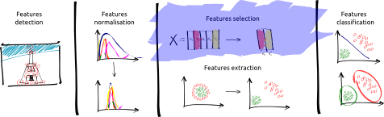

# SI - Pattern Recognition

**Table-of-contents**

* [Dependencies](#dependencies)
* [Features selection](#features-selection)
* [To perform the practise](#to-perform-the-practise)

More description is given in the subsections.

## Dependencies

The following practise has been tested with **Ubuntu 14.04**.

In order to use the Ipython Notebook, the following dependencies are needed:

* IPython - `sudo apt-get install ipython`
* IPython notebook - `sudo apt-get install ipython-notebook`
* Numpy - `sudo apt-get install python-numpy`
* Matplotlib - `sudo apt-get install python-matplotlib`
* Scipy - `sudo apt-get install python-scipy`
* Plotly - `sudo pip install plotly`

We strongly recommend to use a Linux environment to perform this practise.

## Features selection

The following module of the framework will be studied:

Several features normalization methods will be implemented and tested.

- Student's t-test:

More information can be found about the Student's t-test [here](http://en.wikipedia.org/wiki/Student%27s_t-test) and about the Student's distribution [here](http://en.wikipedia.org/wiki/Student%27s_t-distribution).

- Fisher's discriminant ratio:

Insights about LDA can be found in this article [here](http://faculty.ist.psu.edu/jessieli/Publications/ecmlpkdd11_qgu.pdf).

- Metric based on scatter matrices:

More information can be found in the book of [*Pattern Recognition, 2nd edition* from Theodoridis et al.](http://www.manalhelal.com/Books/F2014/Pattern%20Recognition_2003.pdf) in Chap. 5, Sect. 5.5.3.

- Sequential subset selection:

More information can be found in the book of [*Pattern Recognition, 2nd edition* from Theodoridis et al.](http://www.manalhelal.com/Books/F2014/Pattern%20Recognition_2003.pdf) in Chap. 5, Sect. 5.6.

## To perform the practise

### Assignment procedure

In order to perform the practise, you will have to fork the current project. To do so,

- [Fork](https://help.github.com/articles/fork-a-repo/) the current project by click on the Fork icon ,
- Select your GitHub profile if necessary,
- Clone the repository ,
- Solve the practise by executing the Ipython notebook,
- Commit & push your changes in your own repository,
- Make a [pull request](https://help.github.com/articles/using-pull-requests/).

### Execute the Ipython notebook

Enter the following command in a terminal `ipython notebook`.

This command should run the server locally via your default web browser and you will be able to play with the notebook.

If you are just curious to see what the ipython notebook look like, you can view it [there](http://nbviewer.ipython.org/github/ViBOT-Erasmus/B31XI-SI-Features-Selection/blob/master/features-selection.ipynb).

Enjoy!!!

